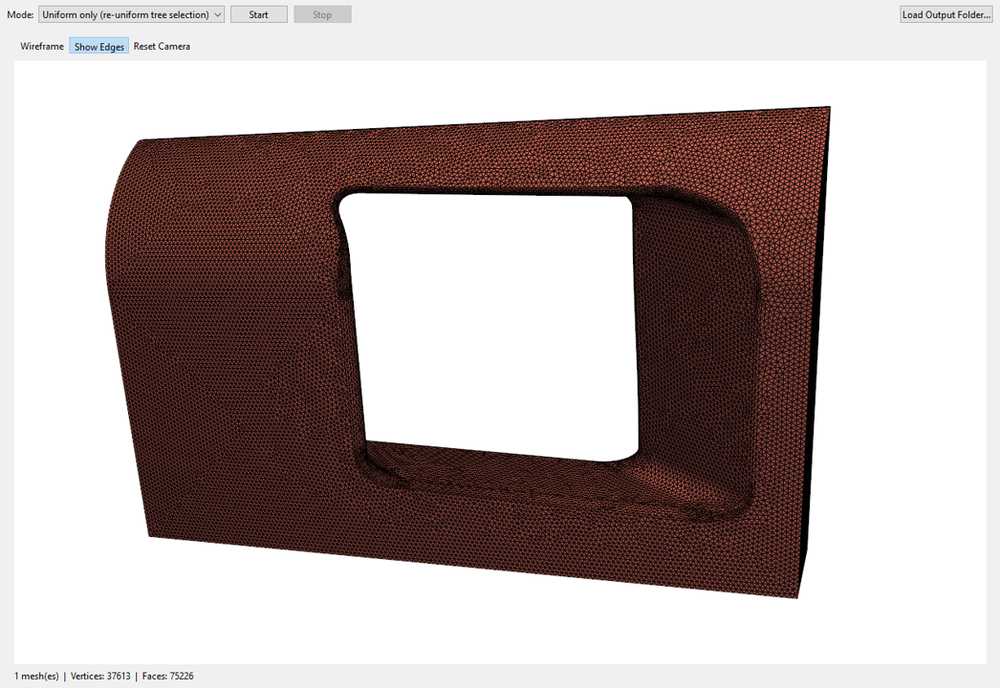

# Mesh Viewer

GUI meshing tool that uses Ansys prime meshing tool to mesh .step files, .fmd files and so on.

After that, mesh uniformization can be done to get better results.

Different meshes can be easily compared in the integrated viewer:



## Layout

```
src/mesh_viewer/
    main.py            # application entry point
    gui/                # PySide6 windows/widgets
    core/               # meshing + uniforming pipeline wrappers
    io/                 # file discovery / output writing
```

## Setup

```powershell
python -m venv .venv
.venv\Scripts\Activate
pip install -r requirements.txt
```

## Run

```powershell
python .\src\mesh_viewer\main.py
```
